# Operations Handbook  
### webMethods.io Integration  
**Version 1.0** | **April 2024**

## Version History

| Version | Date       | Description                               |
|---------|------------|-------------------------------------------|
| 1.0     | April 2024 | First document release ready for Review    |

## Table of Contents

1. [Introduction](#introduction)
   - [Operational Details](#operational-details)
     - [Tenant Management](#tenant-management)
     - [Security Management](#security-management)
     - [Operational Monitoring](#operational-monitoring)
   - [Execution Results](#execution-results)
     - [Workflow Execution Results](#workflow-execution-results)
     - [Flow Service Execution Results](#flow-service-execution-results)
   - [Availability of Execution Results](#availability-of-execution-results)
   - [Audit Logs](#audit-logs)
   - [End-to-End Monitoring](#end-to-end-monitoring)
2. [References](#references)

---

## Introduction
<Introduction in relevance to the context of “webMethods.io Integration Operations in brief”>
1.	Need enablement to access right data to take right action promptly in case of any issues.
2.	Also enabled to monitor and observe the state of the system with ease to ensure minimal to no impact to Business with Integrations hosted on Webmethods.io Integration.
   
This Guide serves as a handbook for consultants, and covers the information required by operations team to be able to perform various activities as part of Operations on day-to-day basis and on regular basis on webmethods.io Integration Platform with minimal support by Webmethods Cloud Ops, using the Out of the box product features after completing this workshop.

---

## Operational Details
Below sections explain how each of the operational procedures listed can be performed on webmethods.io Integration product.
### Tenant Management
Administration activities to keep the platform up to date with latest fixes as per releases by, SoftwareAG cloud operations team, including installing fixes, upgrades, user onboarding, modifying access privileges Super-user like access.
This task includes discover tenant details with a tenant user created by SAG cloud Ops team while provisioning tenant.

Tenant management covers information about Tenant profile and tenant type, Security management and Environments and Stage setup.

### Security Management
Keep tenants safe from unprivileged users, by providing required and limited access to tenant and its assets.

For various tasks to be performed by operations team for Tenant Management and Security Management, step by step information is detailed in the sections referenced below:

#### Tenant Profile and Tenant Type Details

| S No. | Topic                                                                                                | Reference from Operational Manual                                                                                      |
|-------|------------------------------------------------------------------------------------------------------|------------------------------------------------------------------------------------------------------------------------|
| 1     | How to identify tenant type and tenant version?                                                       | Detailed in section 3.1 and 3.2 of Tenant Management - PRIME Guide - webMethods.IO_Integration_Operations_ManualPart1.docx |
| 2     | How to verify tenant profile like subscription plan details? (If required to upgrade)                 | Security Management - Role Management / User management                                                                |
#### Security Management - Role Management / User management

| S No. | Topic                                                                                                | Reference from Operational Manual                                                                                      |
|-------|------------------------------------------------------------------------------------------------------|------------------------------------------------------------------------------------------------------------------------|
| 3     | List of activities of tenant users, various roles (system defined)                                    | Detailed in section 3.3 of Tenant Management - PRIME Guide - webMethods.IO_Integration_Operations_ManualPart1.docx      |
| 4     | What are the system-defined roles and their activities?                                               |                                                                                                                        |
| 5     | How to create custom roles, what permissions to define, and how to define custom roles?               |                                                                                                                        |
| 6     | How to add roles to users while creating users and associate users to projects for deployments?       |                                                                                                                        |
| 7     | What are the system-defined roles and activities performed with these roles?                          |                                                                                                                        |
| 8     | What permissions does a tenant user have for user management?                                         |                                                                                                                        |

#### Environments and Stage Setup

| S No. | Topic                                                                                                | Reference from Operational Manual                                                                                      |
|-------|------------------------------------------------------------------------------------------------------|------------------------------------------------------------------------------------------------------------------------|
| 9     | What are the activities involved in managing environments/stages?                                     | Detailed in section 4 - Manage Environments and Stages - PRIME Guide - webMethods.IO_Integration_Operations_ManualPart1.docx |
| 10    | As part of managing environments, how to register and enable tenants to deploy assets from non-prod tenants? |                                                                                                                        |
| 11    | How to create a production environment with a provisioned production tenant?                          |                                                                                                                        |
| 12    | How to allow users to access environments?                                                            |                                                                                                                        |
| 13    | How to link environments to deploy assets from non-prod tenants to a production tenant?               |                                                                                                                        |
| 14    | How to update environments?                                                                           |                                                                                                                        |
| 15    | How to delete environments?                                                                           |                                                                                                                        |
| 16    | What are stages, how to create stages, and why must stages be created?                                |                                                                                                                        |

#### How to Know?

| S No. | Topic                                                                                                | Reference from Operational Manual                                                                                      |
|-------|------------------------------------------------------------------------------------------------------|------------------------------------------------------------------------------------------------------------------------|
| 12    | How to check the status of the tenant?                                                                | Detailed in section 5 - Troubleshooting - PRIME Guide - webMethods.IO_Integration_Operations_ManualPart1.docx           |
| 13    | How to check the status of tenants across regions?                                                    |                                                                                                                        |
| 14    | How to identify the IP address of the tenant?                                                         |                                                                                                                        |

### Security Management
Operational Monitoring:
When setting up monitoring, there are two things that one wants monitoring to help operations’ team answer: what is broken and why. In other words, you want to monitor the logs, dashboards etc., that indicate symptoms and their potential causes of failure occurrences.

Operations team can monitor logs from Monitor tab on webmethods.io Integration page to understand the statistics of associated with workflows and flowservices. 
Webmethods.io Integration has two types of execution logs for analysis:

---

## Execution Results
> These logs display statistics associated with **execution of
> workflows** as in below dashboard.
>
> 

### Workflow Execution Results
#### Workflow Execution results dashboard:

> These logs display statistics associated with **execution of
> workflows** as in below dashboard.
>
> 

#### Workflow Execution results Status:

-   **Successful**: Workflow execution is completed successfully.

-   **Stopped**: Workflow execution is stopped.

-   **Running**: Workflow is currently being executed.

-   **Timeout**: Workflow execution has failed to complete in the
    > allotted time.

-   **Queued**: Workflow execution has not been initiated yet. The
    > workflows with Queued status are executed automatically after a
    > specific time period.

-   **Failed**: Workflow execution has failed to complete.

#### Resume and restart workflows:

> Workflows enabled to resume and restart for **failed or timed out
> transactions** can be resumed and restarted respectively. Operations
> team will be prompted to edit data before resuming or restarting.

#### Download Logs:

> Logs with selected date range can be downloaded in **csv or json
> format** in Work Flow execution Dashboard Section.
>
> 

 
### Flow Service Execution Results
#### Flow Service Execution Results Dashboard:

> These logs display statistics associated with **execution of flow
> services** as in below dashboard.
>
> 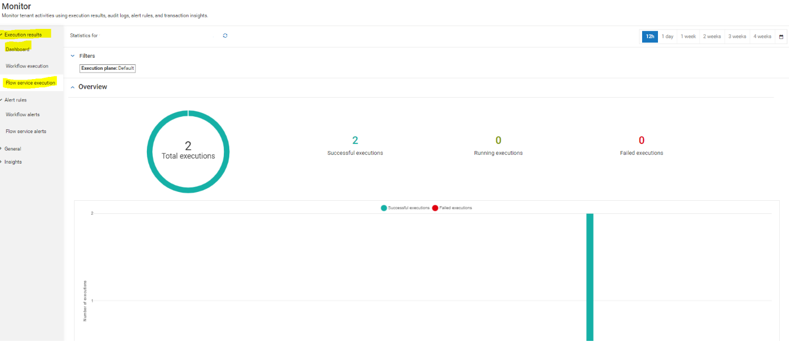

-   **Successful**: Flow service execution is completed successfully.

-   **Failed**: Flow service execution has failed to complete.

-   **Running**: Flow service is currently being executed. See
    the [Terminating Flow service
    executions](https://docs.webmethods.io/integration/monitor/monitorsections/#terminating-running-flowservice-executions) section,
    to stop ongoing Flow service executions.

#### Download Logs:

> Logs with selected date range can be downloaded in csv or Json format
> in Flow service execution Dashboard Section.
>
> 

---

## Availability of Execution Results
> Duration of availability of these logs is by default upto maximum of
> last 30 days.
>
> The operation team can filter logs on date range as in dashboard
> screenshot above. To know more about logs availability duration, reach
> out to Software AG Cloud Ops team through SI incident.
>
> For more information on Execution Results visit documentation page. --
>
> <https://docs.webmethods.io/integration/monitor/monitorsections/#ta-execution_results>

---

## Audit Logs
The **Audit** Logs section maintains a record of all the activities
performed by the users logged into tenant. It maintains a history of all
the actions that are performed within a tenant, including details **such
as type of action performed, the user performing the action, and
date/time.**

Navigate to tenant homescreen and then click **Monitor \> Audit Logs**
to access these logs.

1.  Audit Logs are available on wM.io Integration for duration of **last
    30 days**.

2.  Operations team can **filter** on **date range, Time, Module, Title
    and Action fields** to query logs.

3.  Can download logs locally in **CSV or JSON** format. To download
    click the **Download Logs** button located at the upper-right corner
    of the **Audit** **Logs** screen.

4.  Above screenshot provides info on Actions like Create Workflow and
    User Login of tenant users.

5.  For the **Develop Anywhere, Deploy Anywhere and Central Control,
    Distributed Execution** capabilities, audit logs are supported for
    the following operations:

    a.  Create edge runtime

    b.  Create cloud runtime

    c.  Add OAuth 2.0 token

    d.  Update an edge runtime description

    e.  Enable or disable runtime

    f.  Deregister an edge runtime

    g.  Cancel or timeout edge runtime registration

    h.  Delete an edge runtime instance

    i.  Sync a develop anywhere flow service

> For more information on Audit logs visit documentation page. -
> <https://docs.webmethods.io/integration/monitor/monitorsections/#ta-monitor_general>
---

## End-to-End Monitoring
+-----------------------------------------------------------------------+
| > **[Note]{.underline}**: Currently, End-to-End Monitoring does not   |
| > support any asynchronous requests.                                  |
+-----------------------------------------------------------------------+

### License Type

To enable End to End Monitoring on Tenant Subscribed, customer should
have enterprise Plus tier license, else upgrade to this license. Inspite
of the license this feature is not enabled on the tenant, escalate with
Manager from SoftwareAG.

### Custom Domain

A custom domain is a unique name that identifies enterprise or
organization. If you do not want to expose the default domain provided
by webMethods.io End-to-End Monitoring. In such cases, customize the
default tenant URL or domain and access the tenant and using custom
domain.

Use custom domains if an application accessible on your own domain.
Custom domains direct requests to customer domain URL.

### How It Works

You can request a custom domain name for your tenant.

**For example,** if your company domain is *abc.com*, you can have the
domain name as https://*subdomain*.abc.com. Contact Software AG Global
Support for details on how to enable and configure the custom domain
capability.

#### Subdomain Name Prerequisites

-   The subdomain name should not contain **"."** (for example,
    abc.xyz), as the **webMethods.io End-to-End Monitoring** truncates
    the rest of the string after encountering the first period in the
    subdomain name.

-   The length of the subdomain name should not exceed 20 characters.

-   The requested subdomain name should be unique and available.

#### Steps to configure custom domains

1.  Determine the number of domains to be configured for an account and
    the list of custom domains. The domain names are owned by tenant
    Owner/Administrator.

2.  Decide the SSL certificate needed, whether to secure:

    -   A single domain or

    -   Multiple subdomains of a domain or

    -   Multiple domain names.

3.  Share the number of domains to be configured for an user account and
    the list of custom domains with Software AG.

4.  Software AG will create a certificate signing request (CSR) and will
    provide the details.

5.  Based on the CSR, get the SSL certificates from a Certificate
    Authority (CA) and determine the number and type of domains to be
    secured by the certificates.

6.  Send the SSL certificates to Software AG to configure the
    certificates on the custom domain load balancer.

7.  Software AG will send the CNAME. Using the CNAME, configure DNS to
    point to the custom domain load balancer.

8.  After the configuration is complete, start using the custom domain
    to access webMethods.io End-to-End Monitoring.

#### Dashboard

> The **Dashboard** for End-to-End Monitoring gives a collective view of
> all the business transactions carried out within client's enterprise
> SoftwareAG cloud platform provisioned. The **default Dashboard** view
> includes the **transaction widgets, Transactions list** and **Groups
> list.**
>
> **\
> **Navigate to App switcher and click on icon as below:
>
> 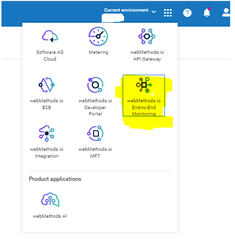
>
> **[Default view of Dashboard:]{.underline}**
>
> 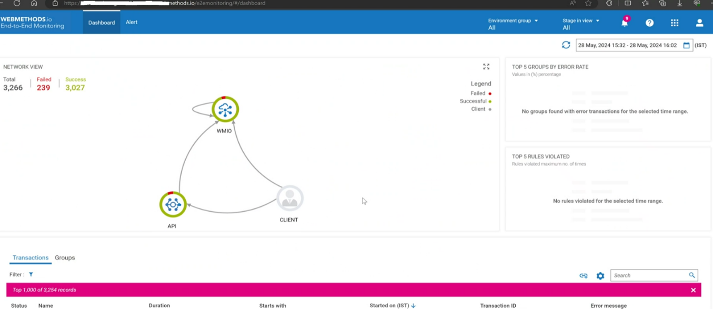
>
> For more Information:
> <https://docs.webmethods.io/e2e/using_e2e/dashboard_alerts/#co-dashboard>

#### Alerts

> The Alert page lists all the **Rule violations** and the **Rule
> list**. These rules are a set of conditions. When these conditions are
> met by a group of transactions, then it's a rule violation.
>
> More Information:
> <https://docs.webmethods.io/e2e/using_e2e/dashboard_alerts/#co-alerts>

### Data Analysis: Insights

Additional to metering functionality that provides transaction count,
considering the situation if business stakeholders want to know more
about the transaction to analyse transactions data, each tab in Insights
section provides this information.

1.  **Overview**: this page provides transaction count of workflows and
    flowservices.

2.  **Analytics:** this page provides graphical representation of
    transactions per project.

3.  **Highlights:** this page provides transactions per service; this
    insight provides inputs to transaction billing with information on
    number of transactions and number of executions per service.

4.  **Reports:** this page provisions option to download reports with
    services and its transaction and execution count.

> For more information on Insights visit documentation page. -
> <https://docs.webmethods.io/integration/monitor/monitorsections/#co-monitor_insights>

#### Incident Management:

> An incident is** an unplanned interruption to a workflow and flow
> service or a reduction in its quality (timeout due to no response or
> slow response) of executions due to failures**. When such failures
> occur, it must be notified to the operations team.
>
> For every deployment of an integration, before deployment it is
> important to verify whether all the failures are handled in the flows,
> so that alert rules can be configured to get notified and act
> accordingly.
>
> This can be achieved with an out of the box feature, configuring alert
> rules for any failures in flow services and workflows deployed to
> production tenant.
>
> This section describes when operations team must be notified/alerted
> through notifications (through mails) about failures on Integrations
> to take appropriate action.
>
> **For e.g**. If downstream SAP system is down for unplanned
> maintenance, on being alerted, disable workflow sending data to SAP
> system until this activity is completed to avoid failures.

+-----------------------------------------------------------------------+
| > **[Note]{.underline}**: webMethods.io Integration provides the      |
| > following options when you set an alert rule for workflows:         |
|                                                                       |
| 1.  **Use custom sender address for alert email notifications:** SMTP |
|     configurations to send alert email notifications from Operational |
|     team sender address. share the relevant details of SMTP           |
|     configuration with SoftwareAG cloud Ops team to set up a custom   |
|     SMTP config internally for the tenant.                            |
|                                                                       |
| 2.  **Display tenant name in the subject of the alert email           |
|     notification:** This helps to clearly distinguish between alert   |
|     notifications of different tenants. Subject format: webMethods.io |
|     Integration alert -\<workflow_name\> from Tenant: \<tenantname\>  |
|                                                                       |
| 3.  **Display tenant timezone in alert email notifications**: Alert   |
|     email notification displays the relevant time zone of the tenant  |
|     for which the notification is created.                            |
|                                                                       |
| 4.  It is recommended **not to** **configure alert rules only for     |
|     success events** to avoid too many mails to recipients **if no    |
|     action to be taken in case of success**.                          |
+-----------------------------------------------------------------------+

### Configure Alert Rules

#### Workflow Alerts

##### Adding Workflow Alerts

The Alert Rules option helps to send alert notifications to specific
recipients when a certain event(s) occurs during workflow execution.
This helps to inform relevant users and updated about the status of
workflow executions.

1.  **To add a new alert rule, navigate** to webMethods.io Integration
    homescreen-\> Monitor-\> Workflow Alerts**.**

> 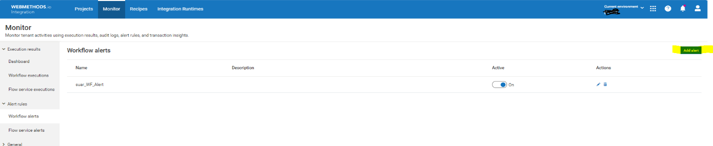

2.  Click on the **[Add Alert]{.underline}** button located at the right
    of the screen to create a new alert rule.

> 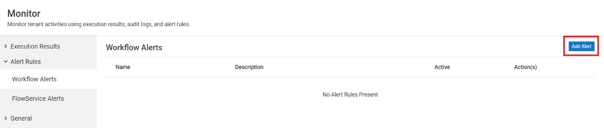

3.  In the New Workflow Alert configuration screen that appears, enter
    the details as given below:

> **Name**: Provide a suitable name for the alert rule.
>
> **Description**: Enter a short description for the alert rule.
>
> **Select Workflows**: Here, you will find the list of all projects and
> their associated workflows. From this list, select the workflow(s) for
> which you want to create the alert rule.
>
> **Select Event**: Select the event(s) for which you want to set the
> alert rule.
>
> **Add Users**:. Select the email IDs of the users you want to send the
> alert notification when the specified event(s) occur(s).
>
> 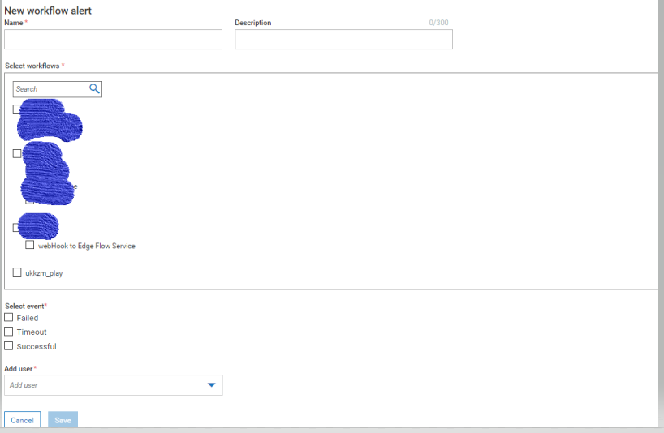

4.  Click on **Save** to add new alert rule for workflow.

#### FlowService Alerts

The Alert Rules option helps to send alert notifications to specific
recipients when a certain event(s) occurs in flowservice execution. This
helps to inform relevant users and updated about the status of
flowservice executions.

+-----------------------------------------------------------------------+
| > **[Note]{.underline}**:                                             |
|                                                                       |
| 1.  After delete a Flow service from the tenant, the alert rule (if   |
|     added) associated with that Flow service will be automatically    |
|     removed from the list of existing alert rules.                    |
|                                                                       |
| 2.  Select the alert frequency period (5 mins, 10 mins, or 15 mins)   |
|     to send email messages as per the requirements by clicking on the |
|     drop-down arrow beside Alert Frequency.                           |
+-----------------------------------------------------------------------+

##### Adding flowservice alerts

1.  **To add a new alert rule, navigate** to webMethods.io Integration
    homescreen-\> Monitor-\> Flowservice Alerts**.**

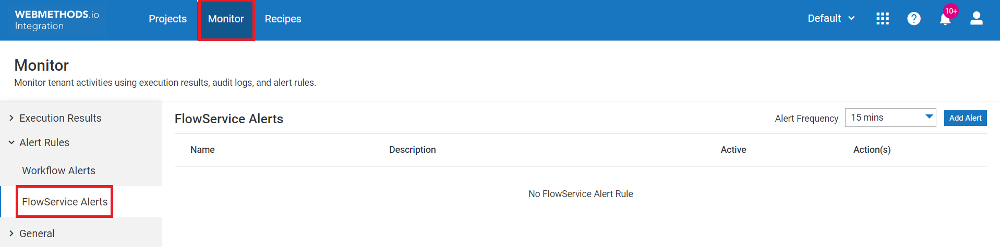

2.  Click on the **Add Alert** button located at the righthand of the
    screen to create a new alert rule, also add an alert frequency
    period (5 mins, 10 mins, or 15 mins) to specify how often the alert
    rule should run.

> 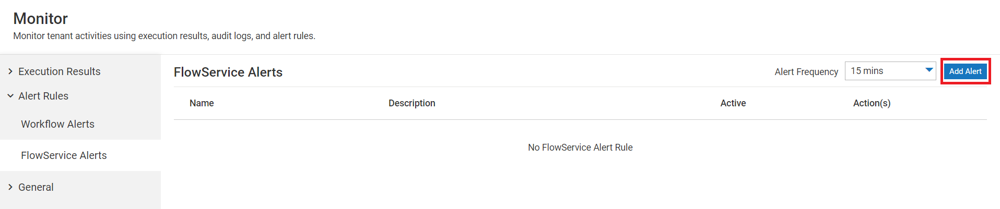

3.  Add details as below:

> 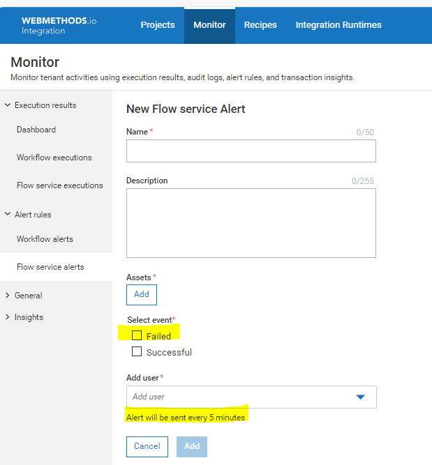

Once **New Flow service Alert** configuration screen appears, enter the
details as given below:

-   **Name**: Name for the alert rule.

-   **Description**: Enter a short description about the alert rule for
    > which flowservice alert rule has to be configured.

-   **Assets**: Click **Assets** and an **Add Assets** pop-up window
    > appears. list of all projects and assets created can be viewed in
    > the drop-down list. Select the asset for which you want to create
    > the alert rule.

-   **Select Event**: Select the event(s) to set the alert rule. Either
    > **Failed** or **Successful.**

-   **Add User**: Select the email ID(s) of the users you want to send
    > the alert notification to when the specified event(s) occur(s).

4.  After entering these details, click Add to create new alert rule.

#### Deployment Considerations

This section describes recommended considerations for deployment to Prod
tenant.

**[Important considerations for deploying Projects to Prod Tenant are as
follows:]{.underline}**

1.  Track assets of project published while publishing as this
    facilitates to identify changes made to target environment after
    deploying published assets.

2.  Once environments are linked for deployments, always stage code for
    review from the environment considered for publishing assets to
    deploy to Prod Tenant.

3.  Perform code review for assets being deployed.

4.  Keep Track of assets being deployed with rationale of what is being
    deployed, where is it deployed and who is deploying what are
    business benefits.

5.  In case of roll back required after deploying assets, then those
    assets tracked while publishing can be restored back to previous
    version manually by viewing Version History for each asset deployed
    as **there is no one click rollback for entire Project.**

6.  Ensure there is appropriate **logging and exception handling** for
    major step of the flows to be able the support of the flow being
    executed in case of any failures.

#### Tenant Maintenance:

-   One of the responsibilities of the operations team is to ensure the
    platform is up to date with latest fixes and releases as and when
    available.

-   Whenever new fix/release is available on tenant, tenant
    Administrator can view the release as notification and fix details
    can be found in readme document of the fix released. Subscribe to
    the statuspage.io site for notification on upcoming tenant updates.

> **[Status of region SoftwareAG cloud Tenants across
> regions]{.underline}** in geography can be found at url:
> [**https://status.webmethods.io/#**](https://status.webmethods.io/)

-   Tenant administrators can install fixes with communication to all
    the stakeholders like end application teams (upstream and
    downstream) and development team.

**\<*Add more points if required\>***

#### Maintenance of renewable assets:

There are assets configured and used which tend to expire after certain
duration, keep a tab of such assets and act promptly to avoid impact due
to expired assets. Expirable assets like Certificates, AuthId ( e.g.
OAuth Client Id with Client secret, come to the end of validity period)
are mostly in usage for authentication.

'[Secure Sockets Layer (SSL) is a means of securing communications over
a network so that only the sender and receiver have access to the
sensitive data."]{.underline}

For secure connectivity i.e SSL Handshake between wM.io Integration and
other applications, certs can be configured, if certificates are
configured for authentication, then such assets need to saved and stored
in safe repository and have to be renewed before its expiry date and
shared with impacted stakeholders as required, to ensure no impact to
integrations.

This section can precisely cover How to update renewed certificates on
webMethods.io Integration.

1.  There are two types of certificates for invoking flowservices to be
    invoked as Restful APIs on webMethods.io Integration.

    a.  **User Certificates** for authenticating users connecting to
        Webmethods.io Integration for two- way SSL handshake.

> **[Note: Only Tenant Administrators can create certificates for
> users]{.underline}**

b.  **Tenant Certificate** when Tenant credentials and Tenant
    certificate is used for authentication.

c.  **Partner Certificate for SSL handshake over http** with partners.

d.  For these two instances Certificates must be updated on expiry.

##### Update User Certificate

1.  Go to the **Client Certificate \> User Certificate **page. In
    the Select User field, select the user. In the Select
    Certificate field, select Generate Private Key and Certificate.
    Click Generate and select the format to generate the certificate.
    The generated certificate is named as username.fileformat.

> 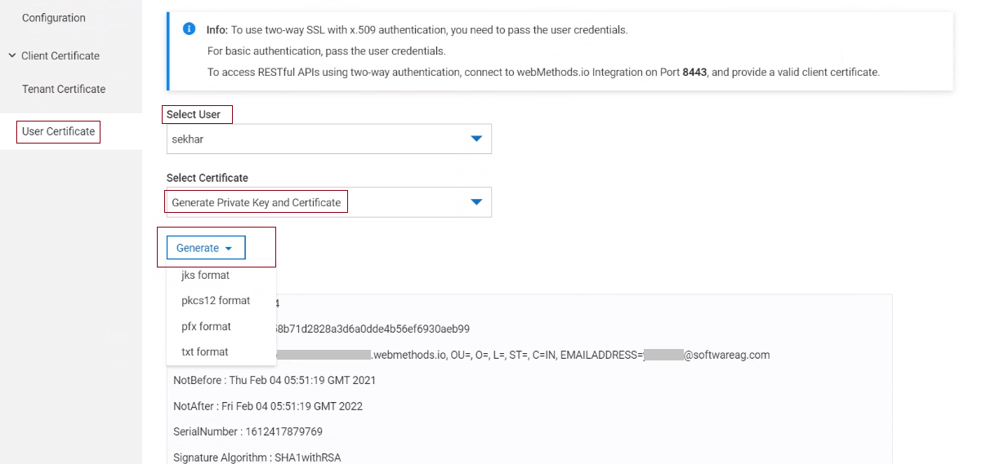

2.  Open any REST client and configure the certificate generated from
    the tenant.

3.  To replace old certificate in the flow services with new
    certificate, Go to webMethods.io Integration and for the Flow
    service, select **Overview \> Advanced details**.

4.  Copy the synchronous URL and specify it in the Host field.

5.  Specify the port number as 8443.

6.  Select the generated certificate and provide the certificate
    passphrase. The default passphrase used to generate certificate.

7.  Click **Add**.

> 

#####Update Tenant Certificate

1.  For Two-way SSL security mode to work with a tenant certificate, the
    following are mandatory:

    a.  Tenant credentials

    b.  Tenant certificate

2.  To update tenant certificate generated by CA, navigate to
    **Settings** on User Icon, Click on **Tenant certificate**, Select
    **Upload New Certificate**, then **browse** cert file and upload
    renewed certificate.

> 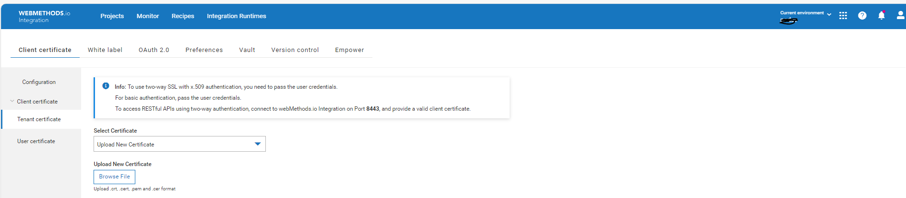

##### Update Partner Certificate

1.  To update partner certificate Click on Project configured with
    partner certificate.

2.  Navigate to Configurations-\> Certificates, Edit certificate to
    browse new cert file and upload renewed certificate.

---

## References

1.  Here are the references for out of the box API's:

      [webMethods.io Integration API Reference - webMethods.io
      Integration](https://docs.webmethods.io/integration/apis/webmethods_api_ref/#gsc.tab=0)

2.  Documentation: [Overview - webMethods.io
       Integration](https://docs.webmethods.io/integration/starthere/home#gsc.tab=0)

3.  Hybrid Integration: [Hybrid Integration - webMethods.io
       Integration](https://docs.webmethods.io/integration/hybrid_integration/hybridintegrationdetails/#gsc.tab=0)

4.  Limitations:
    <https://docs.webmethods.io/integration/release_readme/readme110#limitations>
